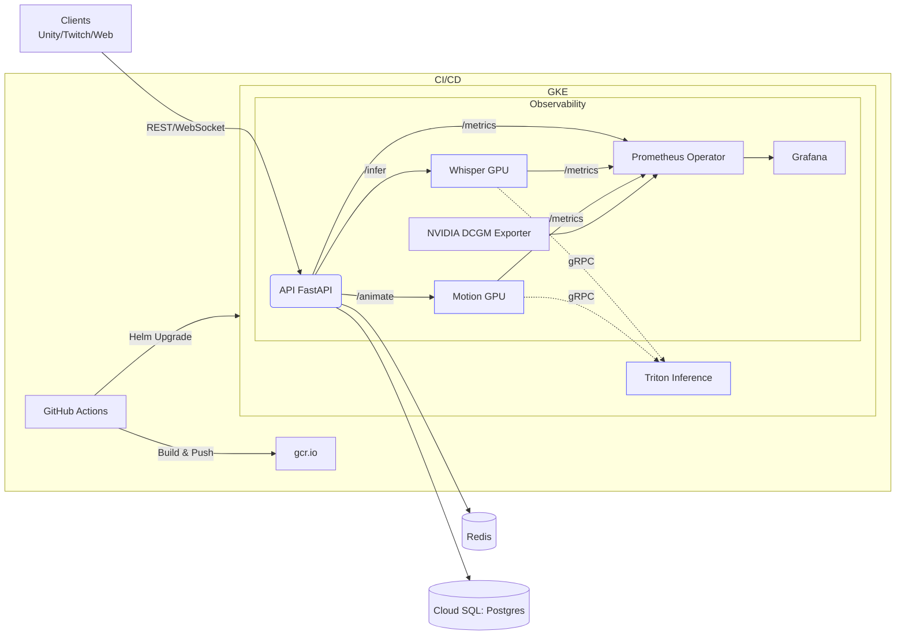
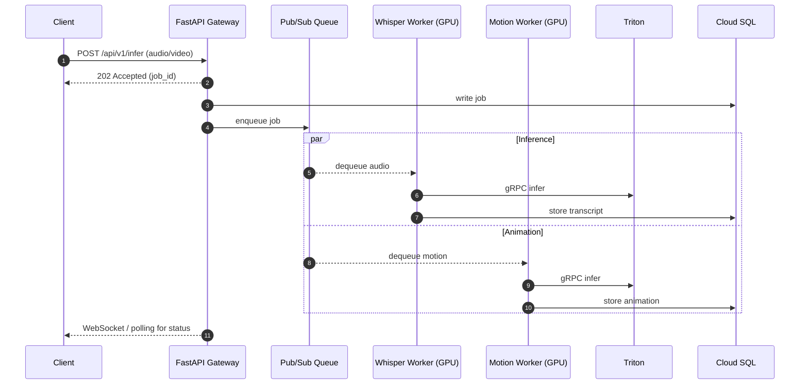
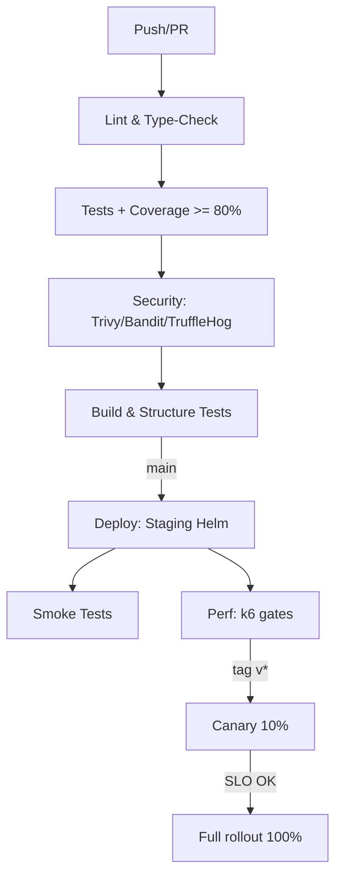

# Rebellis — Real‑Time Text‑to‑Motion Backend

> **Production‑grade FastAPI + ML (Whisper, Motion)** on **GKE** with **Helm**, **KEDA**, **Prometheus/Grafana**, **Cloud SQL**, **Workload Identity** and a hardened **DevSecOps** toolchain.

[](https://github.com/yasserebrahimi/rebellis-aws-gcp-migration/actions/workflows/ci.yml)

[](https://github.com/yasserebrahimi/rebellis-aws-gcp-migration/actions/workflows/cd.yml)

[](https://github.com/yasserebrahimi/rebellis-aws-gcp-migration/actions/workflows/performance.yml)

[](LICENSE)
[](#)
[](#)

---

## 🔎 What’s inside
- **Services**: API (FastAPI), Whisper (GPU), Motion (GPU), Triton (gRPC)
- **Infra**: Helm chart with Cloud SQL Proxy v2, Workload Identity, KEDA, NetworkPolicy, Gatekeeper & Kyverno
- **Obs**: Prometheus Operator, Grafana dashboards, SLO alerts, DCGM exporter
- **CI/CD**: GitHub Actions (lint/test/sec/build), canary → full rollout, performance gates
- **Security**: Non‑root images, read‑only FS, secrets via GSM/External‑Secrets, signed images (cosign-ready)

---

## 🏗 Architecture (at a glance)

> Cloud SQL is accessed privately via **Proxy v2** sidecar; GKE → GCP uses **Workload Identity**. KEDA scales workers on queue depth. Prometheus scrapes `/_/metrics` endpoints; Grafana is pre‑provisioned.

---

## 🧬 Request Lifecycle (sequence)


---

## 🧩 Service Matrix
| Capability | API | Whisper | Motion |
|---|:--:|:--:|:--:|
| `/health` + `/ready` + `/startup` | ✅ | ✅ | ✅ |
| `/metrics` (Prometheus) | ✅ | ✅ | ✅ |
| OpenAPI `/docs` | ✅ | — | — |
| GPU scheduling (taints/tolerations) | — | ✅ | ✅ |
| HPA/KEDA autoscaling | ✅ | ✅ | ✅ |
| JSON logs (structured) | ✅ | ✅ | ✅ |

---

## 🧪 SLOs & Alerts (production)
| SLI | SLO | Burn alerts |
|---|---|---|
| p95 latency (API) | ≤ 50ms | 2h / 6h burn |
| 5xx rate (API) | < 0.1% | 15m/1h |
| Whisper p95 | ≤ 3s (30s audio) | 1h |
| Motion p95 | ≤ 2s (frame window) | 1h |
| Replication lag | < 1s | 10m |

> Dashboards & rules are provisioned under `docs/monitoring/` and Helm `monitoring.*` values.

---

## ⚙️ Configuration (ENV)
| Key | Default | Notes |
|---|---|---|
| `ENVIRONMENT` | `development` | env name |
| `DATABASE_URL` | `postgresql+asyncpg://...` | via Cloud SQL Proxy (localhost:5432) |
| `REDIS_URL` | `redis://redis:6379/0` | rate‑limit/cache |
| `TRITON_URL` | `triton.inference.svc:8001` | gRPC |
| `API_V1_PREFIX` | `/api/v1` | base path |
| `WHISPER_MODEL_SIZE` | `base` | tiny/base/… |
| `MOTION_MODEL_PATH` | `/app/models/motion` | path |

---

## 🧰 Makefile
```text
make fmt      # ruff+black+isort
make lint     # static checks
make test     # pytest
make build    # docker build API
make up       # compose up (dev stack)
make down     # compose down
make logs     # tail app logs
```

---

## 🚀 Local Dev (Compose)
```bash
docker compose -f docker-compose.monitoring.yml up -d
docker compose -f docker-compose.yml -f docker-compose.development.yml up -d --build

# Endpoints:
# API http://localhost:8000/docs | /metrics
# Grafana http://localhost:3001 (admin/admin)
```

---

## ☸️ Deploy on GKE (Helm)
```bash
helm upgrade --install rebellis infrastructure/helm/rebellis   -n staging --create-namespace   -f infrastructure/helm/rebellis/values.staging.yaml
```
**Enabled by values**: Workload Identity, Cloud SQL Proxy v2, KEDA, ServiceMonitor/PrometheusRule, External‑Secrets, DCGM exporter.

---

## 🔁 CI/CD pipeline

Workflows live in `.github/workflows/{ci,cd,performance}.yml`.

---

## 📦 Repository Layout
```text
.
├─ src/                    # FastAPI app + services
├─ scripts/                # setup/deploy/backup/health/...
├─ docker/                 # Dockerfiles for ML workers
├─ infrastructure/
│  ├─ helm/rebellis/       # Helm chart (values: dev/staging/prod)
│  └─ terraform/           # (optional) GCP IaC
├─ docs/                   # Architecture, ops, security, runbooks
├─ tests/                  # unit & integration tests
├─ docker-compose*.yml     # local stacks
└─ README.md
```

---

## 📈 Migration Snapshot (from the plan)
- 10‑week roadmap with **shadow → canary → cutover** and rollback guardrails.  
- Phase‑3 cost (GKE) expected **~$1.5k/month** at 50% utilization (min $858, max $3,798).  
- Success criteria: 100% traffic on GCP, p95<50ms, error<0.1%, lag<1s, rollback<5min.

> Full details in `docs/migration/aws-to-gcp.md`.

---

## 🔒 Security Posture
- **Pods**: non‑root, read‑only FS, `allowPrivilegeEscalation=false`, drop ALL caps.
- **Network**: default‑deny `NetworkPolicy`, namespace‑scoped policies per env.
- **Policy**: Gatekeeper & Kyverno constraints (image registry, no hostPath, res‑limits).
- **Secrets**: External‑Secrets (GSM), WI bindings; no kube secrets in VCS.

---

## 🧭 Troubleshooting
- Empty `/metrics` → check ServiceMonitor (port name `http`, path `/metrics`).
- DB timeouts → ensure Cloud SQL Proxy sidecar healthy; point DSN to `localhost:5432`.
- GPU scheduling → nodeSelector/taints must match GPU pool; DCGM Exporter running.

---

## 📝 License
MIT — see [LICENSE](LICENSE).
