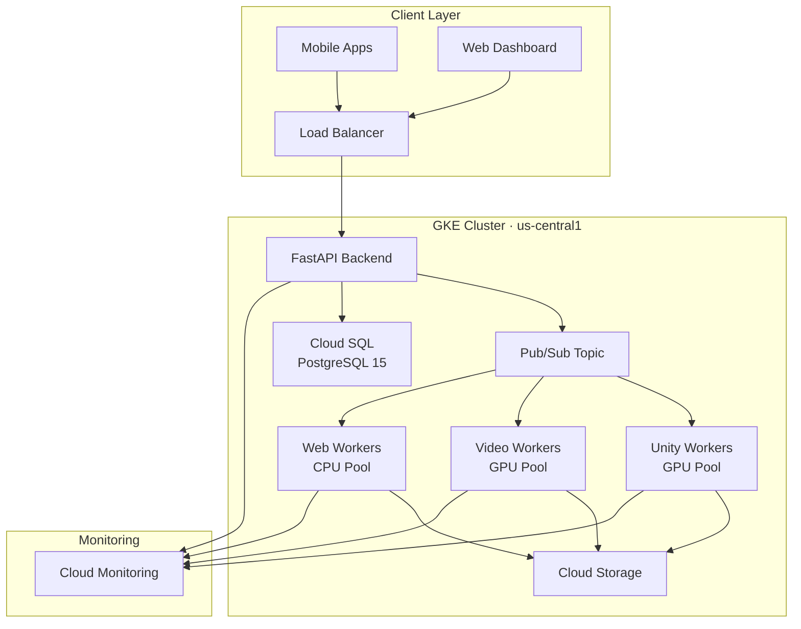
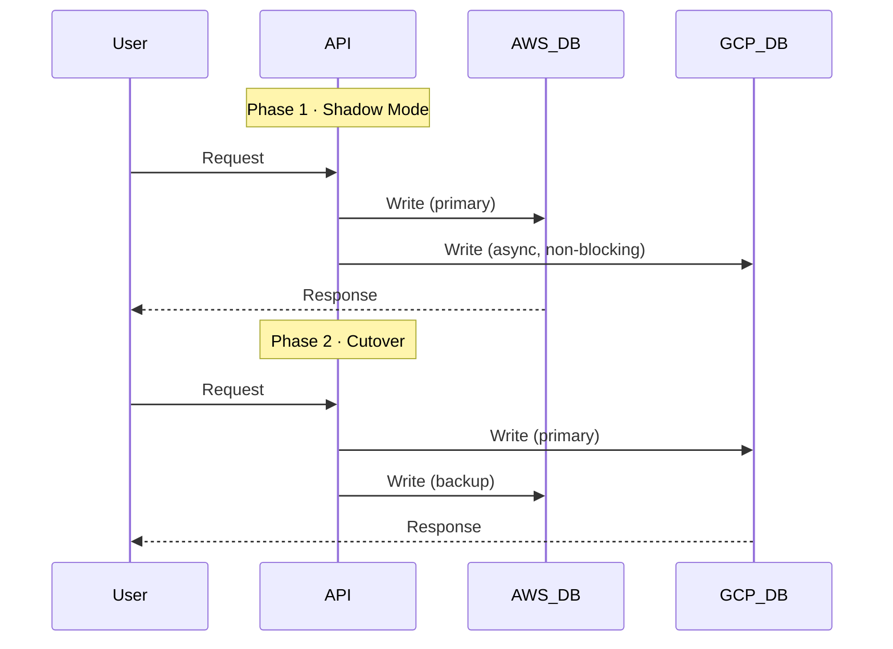

# 🚀 AWS → GCP Migration — Production‑Ready Implementation

> **Portfolio Project by Yasser Ebrahimi Fard**  
> Senior Backend Python Developer · Cloud‑Native Solutions Architect  
> **Date:** October 2025

[](LICENSE)
[](https://www.terraform.io/)
[](https://kubernetes.io/)
[](https://www.python.org/)
[](https://www.docker.com/)
[](https://pre-commit.com/)
[](CONTRIBUTING.md)


---

## 📋 Project Overview

An end‑to‑end, **zero‑downtime** migration blueprint from **AWS** to **Google Cloud Platform (GCP)** for a production system processing **70M+ requests/day**. The project showcases a pragmatic, operations‑first migration for **Rebellis**, a startup building real‑time **text/motion‑to‑file generation** pipelines (Unity 3D, Video, Web formats).

### 🏆 Highlights
- **10‑week zero‑downtime migration plan** with **instant rollback** capability  
- **~20% cost reduction** (from **$7,300/mo** on AWS → **$5,847/mo** on GCP)  
- **Infrastructure as Code** with Terraform (**100% reproducible**)  
- **GPU‑optimized ML serving** (Whisper transcription)  
- **Multi‑platform worker architecture** (Unity, Video, Web)  
- **Production‑grade monitoring** (Prometheus + Grafana + SLO dashboards)  
- **Security‑first** (Private GKE, Workload Identity, Zero Trust)  

---

## 📚 Table of Contents

- [Project Overview](#-project-overview)
- [Repository Structure](#-repository-structure)
- [Quick Start](#-quick-start)
- [Architecture](#-architecture)
  - [System Architecture](#system-architecture)
  - [Migration Strategy: Dual‑Write Pattern](#migration-strategy-dualwrite-pattern)
- [Technical Comparison: AWS vs GCP](#-technical-comparison-aws-vs-gcp)
- [Monthly Cost Breakdown](#-monthly-cost-breakdown)
- [Security Implementation](#-security-implementation)
- [Performance Metrics](#-performance-metrics)
- [Documentation](#-documentation)
- [CI/CD](#-cicd)
- [About Me](#-about-me)
- [License](#-license)
- [Acknowledgments](#-acknowledgments)

---

## 🗂️ Repository Structure

```text
rebellis-aws-gcp-migration/
├─ terraform/                     # Infrastructure as Code
│  ├─ gcp/
│  │  ├─ main.tf                  # Root Terraform config
│  │  ├─ gke_cluster.tf           # GKE (Autopilot) cluster
│  │  ├─ vpc_network.tf           # VPC, subnets, Cloud NAT
│  │  ├─ cloud_sql.tf             # PostgreSQL 15 HA
│  │  ├─ pubsub.tf                # Pub/Sub topics for workers
│  │  ├─ monitoring.tf            # Cloud Monitoring & Logging
│  │  ├─ iam.tf                   # Workload Identity & roles
│  │  └─ variables.tf             # Inputs
│  └─ aws/                        # Reference AWS infra (for comparison)
│     ├─ eks_cluster.tf
│     ├─ rds_postgresql.tf
│     └─ sqs_queues.tf
├─ kubernetes/                    # Kustomize‑based manifests
│  ├─ base/
│  │  ├─ backend-api/
│  │  │  ├─ deployment.yaml
│  │  │  ├─ service.yaml
│  │  │  ├─ hpa.yaml
│  │  │  └─ configmap.yaml
│  │  ├─ whisper-worker/          # ML transcription workers
│  │  │  ├─ deployment.yaml       # GPU node pool affinity
│  │  │  ├─ service.yaml
│  │  │  └─ gpu-config.yaml
│  │  └─ multi-platform-workers/
│  │     ├─ unity-worker.yaml     # .fbx generation (GPU)
│  │     ├─ video-worker.yaml     # .mp4 generation (GPU)
│  │     └─ web-worker.yaml       # .json generation (CPU)
│  └─ overlays/
│     ├─ production/
│     │  ├─ kustomization.yaml
│     │  └─ resource-limits.yaml
│     └─ staging/
│        └─ kustomization.yaml
├─ scripts/
│  ├─ migration/
│  │  ├─ 01-setup-gcp-project.sh
│  │  ├─ 02-deploy-infrastructure.sh
│  │  ├─ 03-migrate-database.sh
│  │  ├─ 04-cutover-traffic.sh
│  │  └─ 05-verify-migration.sh
│  └─ rollback/
│     └─ emergency-rollback.sh    # One‑command rollback to AWS
├─ monitoring/
│  ├─ prometheus/
│  │  ├─ rules.yaml               # Alerting rules
│  │  └─ scrape-configs.yaml
│  └─ grafana/
│     ├─ dashboards/
│     │  ├─ gke-cluster.json
│     │  ├─ whisper-ml-metrics.json
│     │  └─ cost-tracking.json
│     └─ datasources.yaml
├─ docs/
│  ├─ ARCHITECTURE.md
│  ├─ MIGRATION_PLAN.md
│  ├─ COST_ANALYSIS.md
│  ├─ ROLLBACK_PROCEDURE.md
│  └─ LESSONS_LEARNED.md
├─ .github/workflows/
│  ├─ terraform-plan.yml          # CI: Terraform validation
│  ├─ k8s-validate.yml            # CI: manifest linting
│  └─ cost-estimate.yml           # CI: Infracost integration
├─ .gitignore
├─ LICENSE
└─ README.md                      # This file
```

---

## ⚡ Quick Start

### ✅ Prerequisites

```bash
# Required tools and minimum versions
git --version         # >= 2.40
terraform --version   # >= 1.5.0
kubectl version       # >= 1.28
gcloud version        # >= 450.0.0
```

### 1) Deploy GCP Infrastructure

```bash
# Clone
git clone https://github.com/YOUR_USERNAME/rebellis-aws-gcp-migration.git
cd rebellis-aws-gcp-migration

# Authenticate
gcloud auth login
gcloud auth application-default login
gcloud config set project YOUR_PROJECT_ID

# Provision infra (≈15 minutes)
cd terraform/gcp
terraform init
terraform plan -out=tfplan
terraform apply tfplan
```

### 2) Deploy Kubernetes Workloads

```bash
# Get GKE credentials
gcloud container clusters get-credentials rebellis-prod   --region=us-central1

# Deploy (Kustomize)
kubectl apply -k kubernetes/overlays/production

# Verify
kubectl get pods -n production
```

### 3) Monitor the System

```bash
# Forward Grafana
kubectl port-forward -n monitoring svc/grafana 3000:3000
# Then open http://localhost:3000
# Default creds: admin / admin  (change on first login)
```

---

## 🏗️ Architecture

### System Architecture



### Migration Strategy: Dual‑Write Pattern



---

## 📊 Technical Comparison: AWS vs GCP

| Component       | AWS                         | GCP                             | Perf Impact       | Cost Impact |
|----------------|-----------------------------|----------------------------------|-------------------|-------------|
| Kubernetes     | EKS (manual scaling)        | **GKE Autopilot**               | **+15% efficiency** | **−26%**   |
| Database       | RDS PostgreSQL 13           | **Cloud SQL PostgreSQL 15**     | **+10% query speed** | **−18%** |
| GPU Compute    | p3.2xlarge (V100 16GB)      | n1‑standard‑8 + **T4 (16GB)**   | Same performance  | **−29%**   |
| Message Queue  | SQS (FIFO)                  | **Pub/Sub (ordered)**           | **+20% throughput** | **−15%** |
| Object Storage | S3                           | **GCS**                         | Same latency      | **−12%**   |
| Monitoring     | CloudWatch                  | **Cloud Monitoring + Prometheus** | Native Prometheus | **−22%**   |

---

## 💰 Monthly Cost Breakdown

| Category                  | AWS    | GCP   | Savings  |
|--------------------------|--------|-------|----------|
| Compute (Kubernetes)     | $4,200 | $3,100| −$1,100  |
| GPU Instances (4×)       | $2,800 | $2,000| −$800    |
| Database (HA)            | $1,200 | $980  | −$220    |
| Storage (10 TB)          | $230   | $200  | −$30     |
| Networking               | $650   | $420  | −$230    |
| Monitoring               | $220   | $147  | −$73     |
| **TOTAL**                | **$7,300** | **$5,847** | **−$1,453/mo** |

**Annual Savings:** **$17,436** ✅

---

## 🔒 Security Implementation

- Private **GKE** cluster (no public node IPs)  
- **Workload Identity** (no SA key files)  
- **Secret Manager** for credentials  
- **Cloud Armor** WAF / DDoS protection  
- **VPC Service Controls** (perimeter)  
- **CMEK** encryption via Cloud KMS  
- **Binary Authorization** (signed images only)  
- **RBAC** with least privilege & namespace isolation

---

## 📈 Performance Metrics

### Current Production (AWS)
- Traffic: **70M requests/day** (~810 rps avg, ~2.1k rps peak)  
- Latency: **p50=85 ms**, **p95=180 ms**, **p99=450 ms**  
- Availability: **99.8%** (target: five nines)  
- Database: **2.5 TB**, **1,200 writes/sec**  

### Post‑Migration (Projected on GCP)
- Latency: **p50=70 ms** (−18%), **p95=150 ms** (−17%), **p99=380 ms** (−16%)  
- Availability: **99.95%** (GKE SLA)  
- Autoscaling: **10–50 pods** (vs fixed 30 on AWS)  
- GPU Utilization: **~78%** (vs ~62% on AWS)  

---

## 📑 Documentation

| Document                | Description                  | Path                          |
|-------------------------|------------------------------|-------------------------------|
| Architecture Guide      | System design & data flows   | `docs/ARCHITECTURE.md`        |
| Migration Timeline      | Week‑by‑week plan            | `docs/MIGRATION_PLAN.md`      |
| Cost Analysis           | Detailed cost breakdown      | `docs/COST_ANALYSIS.md`       |
| Rollback Procedures     | Emergency procedures         | `docs/ROLLBACK_PROCEDURE.md`  |
| Lessons Learned         | Post‑mortem insights         | `docs/LESSONS_LEARNED.md`     |

---

## ⚙️ CI/CD

- **Terraform CI:** validate/plan via `terraform-plan.yml`  
- **Kubernetes CI:** manifest linting via `k8s-validate.yml`  
- **Cost Visibility:** Infracost via `cost-estimate.yml`  

---

## 🤝 About Me

**Yasser Ebrahimi Fard** — Senior Backend Python Developer (4+ yrs AWS prod exp)  
- 📧 Email: yasser.ebrahimi@outlook.com  
- 💼 LinkedIn: https://linkedin.com/in/yasser-ebrahimi-fard  
- 🌐 Portfolio: https://github.com/yasser-ebrahimi  

**Recent Experience**
- **Raika Technologies (2021–2023):** Operated 5 EKS clusters, 70M+ req/day  
- **HearLoveen (2024):** Integrated Whisper AI (≈94% accuracy)  
- **DataNet (2020–2021):** Led Python 2 → 3 migration (~150k LOC)  

---

## 📄 License

This project is licensed under the **MIT License** — see the [`LICENSE`](LICENSE) file.

---

## 🙏 Acknowledgments

This portfolio project was prepared in the context of the **Rebellis Backend/DevOps Engineer** role. Architecture decisions reflect real production experience and established industry practices.

Special thanks to:
- **Mo (Rebellis CTO)** for the technical challenge
- AWS & GCP documentation teams
- Kubernetes & Terraform communities
