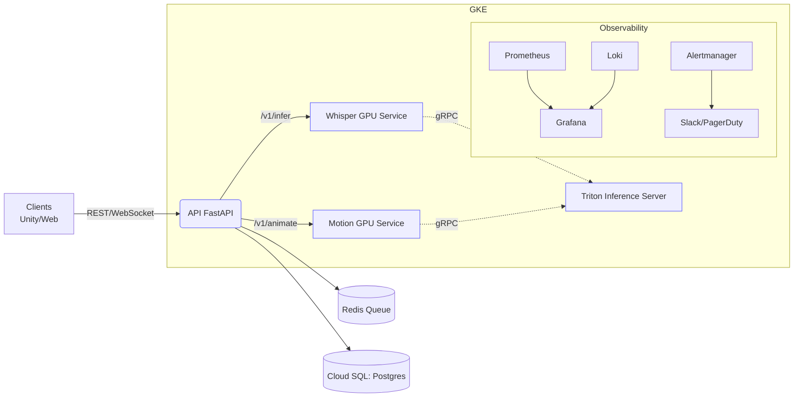

# 🏗️ Architecture Overview

Rebellis converts text into motion in near‑real time. The backend orchestrates model serving (NVIDIA Triton) and streams results to clients via REST/WebSocket. It is optimized for low latency, resilience, and cost efficiency on GKE Autopilot.

**Key principles**
- Separation of concerns for API, inference, and stream processing
- Horizontal scalability and GPU pool isolation
- Observability baked in (RED/USE, SLOs, golden signals)
- Security by default (least privilege, zero‑trust, signed images)
- Immutable infrastructure; declarative config (Helm/Terraform)

