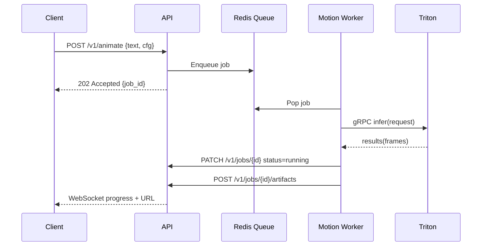

# 🔁 Sequence Diagrams

## Inference (Text → Motion)

```mermaid
sequenceDiagram
  participant C as Client
  participant A as API
  participant Q as Redis Queue
  participant M as Motion Worker
  participant T as Triton
  C->>A: POST /v1/animate {text, cfg}
  A->>Q: Enqueue job
  A-->>C: 202 Accepted {job_id}
  M->>Q: Pop job
  M->>T: gRPC infer(request)
  T-->>M: results(frames)
  M->>A: PATCH /v1/jobs/{id} status=running
  M->>A: POST /v1/jobs/{id}/artifacts
  A-->>C: WebSocket progress + URL
```
